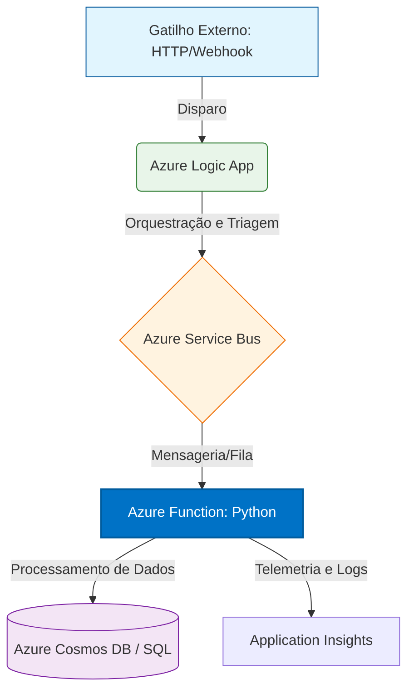

# Arquitetando e Desenvolvendo uma Aplicação Serverless no Azure ☁️🐍

[](https://opensource.org/licenses/MIT)
[](https://azure.microsoft.com/)
[](https://www.python.org/)

Este projeto faz parte do desafio prático da **DIO (Digital Innovation One)** e demonstra a implementação de uma arquitetura robusta e escalável utilizando o modelo **Serverless** da Microsoft Azure. O foco principal é o desacoplamento de serviços e o processamento orientado a eventos (Event-Driven).

---

## 🏗️ Arquitetura da Solução

A solução foi desenhada para ser resiliente e escalável, utilizando serviços que permitem o pagamento apenas pelo uso (Consumption Plan), otimizando custos e performance.

### Fluxo de Dados (Graph TD)


## 🛠️ Componentes do Projeto
 * **Azure Logic Apps:** Responsável pela camada de integração e workflow inicial, recebendo requisições e encaminhando para a fila.
 * **Azure Service Bus:** Camada de mensageria que garante que nenhum dado seja perdido caso haja um pico de tráfego, desacoplando a entrada do processamento.
 * **Azure Functions (Python):** O "cérebro" da aplicação. Desenvolvida em Python, realiza o processamento lógico das mensagens de forma assíncrona.
 * **Application Insights:** Monitoramento em tempo real para identificação de gargalos e rastreamento de erros (Observabilidade).
## 📂 Estrutura do Repositório
```text
arquitetura-serverless-azure/
├── src/
│   ├── functions/            # Camada de Processamento (Backend)
│   │   ├── function_app.py   # Gatilhos e lógica de negócio em Python
│   │   └── requirements.txt  # Bibliotecas e dependências do projeto
│   └── logic-apps/           # Camada de Integração (Workflow)
│       └── workflow.json     # Definição do fluxo exportada da Azure
├── .gitignore                # Proteção de arquivos locais e sensíveis
├── host.json                 # Configurações globais do runtime Azure
└── README.md                 # Documentação principal e diagrama

```
## 🚀 Como Replicar
 1. **Pré-requisitos:**
   * Conta ativa no Azure Portal.
   * Azure Functions Core Tools instalado.
   * Python 3.9 ou superior.
 2. **Configuração Local:**
   ```bash
   git clone [https://github.com/MAIKE-SIMONCINI/arquitetura-serverless-azure.git](https://github.com/MAIKE-SIMONCINI/arquitetura-serverless-azure.git)
   cd src/functions
   python -m venv .venv
   source .venv/bin/activate  # No Windows: .venv\Scripts\activate
   pip install -r requirements.txt
   
   ```
 3. **Deploy:**
   Utilize o comando abaixo para publicar no seu recurso Azure:
   ```bash
   func azure functionapp publish <NOME_DA_SUA_FUNCTION_APP>
   
   ```
## 🧠 Diferenciais e Evolução (IA Roadmap)
Como parte da minha jornada para **IA Engineer**, esta arquitetura foi pensada para suportar:
 * **Análise de Sentimento:** Integração futura com *Azure AI Services* dentro da Function.
 * **Automação Inteligente:** Uso de agentes Python para tomada de decisão baseada nos dados da fila.

**Desenvolvido por Maike Simoncini da Silva** *ADS Technologist | Foco em Cloud, Automação e IA*
